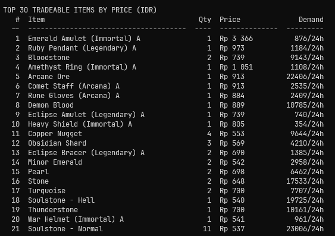

<div align="center">

# 🎮 TBH Inventory Reader

**A live, read-only inventory viewer for *TBH: Task Bar Hero* (Steam).**

Reads your items straight from the game's running memory — no save-file
decryption, no file editing, no cheats — and prints a clean, named, grouped
report as JSON, optionally enriched with **live Steam Market prices**.


<br>

<p align="center">
  
</p>

<sub>✨ Live inventory + Steam Market prices & 24h demand, sorted by value</sub>

</div>

---

## ✨ Features

| | |
|---|---|
| 🔴 **Live** | Reflects exactly what's in memory *right now* — inventory, stash, and equipped gear. |
| 🏷️ **Fully named** | Every item resolved with grade + variant: `Chain Helmet (Legendary) A`. |
| 💰 **Market prices** | Marks items tradeable on Steam Market and fetches live lowest prices in your currency. |
| 📈 **Demand** | Shows 24h sales volume per item, so you know what's actually selling. |
| 🔢 **Sorted** | Items ranked by highest market value — your most valuable loot floats to the top. |
| 🪙 **Wallets** | Gold and other currencies shown with full counts. |
| 📦 **JSON output** | Clean, structured `TBH_inventory.json` — easy to script, grep, or visualize. |
| 🚫 **Zero install** | Pure standard-library Python + the Windows API. No admin rights. |

---

## 🚀 Quick start

> **Prerequisites:** the game must be **running**, and you should open your
> in-game inventory once so the save is resident in memory.

```bash
# 1. Basic inventory report
uv run tbh_inventory.py

# 2. With live Steam Market prices (USD)
uv run tbh_inventory.py --prices

# 3. In your own currency
uv run tbh_inventory.py --prices --currency idr
```

Don't have `uv`? Plain Python works too — no dependencies for the core scan:

```bash
python tbh_inventory.py --prices --currency eur
```

### Sample output

With `--prices`, the tool prints a **top-30 tradeable items** table to the
console (ranked by highest market price) and writes the full sorted JSON to
`TBH_inventory.json`:

```
TBH LIVE INVENTORY  (save 1.00.21)  | 267 instances | inv 96/260 | stash 102/343
CURRENCY: Gold: 1,091,677,988

TOP 30 TRADEABLE ITEMS BY PRICE (USD)
   #  Item                                     Qty  Price              Demand
  --  --------------------------------------  ----  --------------  ---------
   1  Emerald Amulet (Immortal) A                1  $0.20             876/24h
   2  Ruby Pendant (Legendary) A                 1  $0.07           1,184/24h
   3  Bloodstone                                 2  $0.05           9,143/24h
   4  Amethyst Ring (Immortal) A                 1  $0.06           1,108/24h
   5  Arcane Ore                                 1  $0.06          22,406/24h
   ...
```

The JSON is sorted with the **highest-priced tradeable items first**. Each item
carries a `demand` field (units sold in the last 24h):

```json
{
  "save_version": "1.00.21",
  "price_currency": "USD",
  "currency": { "Gold": 1091677988 },
  "owned": [
    {
      "key": 604111,
      "name": "Emerald Amulet (Immortal) A",
      "quantity": 1,
      "level": 50,
      "item_type": "GEAR",
      "gear_type": "AMULET",
      "tradeable": true,
      "price": "$0.20",
      "demand": 876
    },
    {
      "key": 110001,
      "name": "Minor Ruby",
      "quantity": 5,
      "level": null,
      "item_type": "MATERIAL",
      "gear_type": null,
      "tradeable": true,
      "price": null,
      "demand": null
    }
  ]
}
```

---

## 💰 Prices & tradeable status — how it works

Two concepts that are easy to confuse:

| Field | Meaning |
|---|---|
| `"tradeable": true` | The game **allows** this item to be sold on the Steam Market. |
| `"price": "Rp 563"` | Someone is **actively selling it right now**, at this lowest ("starting at") price. |
| `"demand": 876` | Units of this item **sold in the last 24 hours** (market activity / liquidity). |

> 💡 **Why can an item be tradeable but have `price: null`?**
> Because a price only exists when a real human is currently listing the item
> for sale. Tradeable = *can be sold*. A price = *someone is selling it*.
> A tradeable item with `null` price simply means **no active seller at the moment**.
>
> `demand: null` means the same thing on the demand side — no recorded sales in
> the last 24h for your region. High demand + steady price = a liquid item you
> can actually sell quickly.

### Where the prices come from

`--prices` combines two Steam endpoints:

1. **Market search** (`market_scan.py`, USD, cached 30 min in `tbh_market.json`) —
   snapshots *every* listed item with its numeric USD price. This is the complete
   "who's selling" set and gives a clean cross-currency **sort key**.
2. **`priceoverview`** per item you own (cached 30 min in `tbh_prices_<cc>.json`) —
   returns the **lowest price in your currency** *and* the **24h sales volume**
   (the `demand` field). Retries automatically on Steam's `429` rate limit.

The report is **sorted by true market value** (USD cents), so the ranking stays
consistent no matter which currency you display. Items with a price rise to the
top; untradeable or unlisted items sink to the bottom.

```bash
uv run market_scan.py          # refresh the USD market snapshot manually
```

**Supported currencies:**
`usd` `gbp` `eur` `rub` `brl` `jpy` `idr` `myr` `php` `sgd` `thb` `aud` `cad` `cny` `inr` `krw` `try` `uah` `mxn`

---

## 🧠 How it works

TBH stores progress in `SaveFile_Live.es3`, an **AES-encrypted** Easy Save 3 file.
Rather than reverse-engineer the key out of the obfuscated IL2CPP binary, this
tool takes a shortcut:

> **The game has already decrypted your save into RAM. We just read that copy.**

1. 🔎 Finds the running `TaskBarHero.exe`.
2. 🪟 Opens it with `PROCESS_VM_READ` (same Windows user — no admin needed).
3. 🧱 Walks the process's committed memory, scanning for the decrypted save JSON
   (`{"commonSaveData":{"version":...`) in both its UTF-16 (C# string) and ASCII forms.
4. 🏷️ Parses the JSON and maps each numeric `ItemKey` to a human-readable name
   using the game's own localization tables.

Item names, grades, tradeable flags, and market hash names are pre-built from the
game's localization bundles and `ItemInfoData` CSV into `tbh_item_names.json` and
`tbh_item_meta.json`.

---

## 🛠️ Commands

| Command | What it does |
|---|---|
| `uv run tbh_inventory.py` | Print the live inventory as JSON. |
| `uv run tbh_inventory.py --prices` | Add market price + 24h demand; print the top-30 table. |
| `uv run tbh_inventory.py --prices --currency <code>` | Prices in your currency. |
| `uv run dump_names.py` | Rebuild item name + metadata tables after a game update. |
| `uv run market_scan.py` | Refresh the USD market snapshot. |

<details>
<summary><b>All flags</b></summary>

```
tbh_inventory.py [-p] [-c CODE]

  -p, --prices            Fetch live prices from Steam Market (cached 30 min).
  -c, --currency CODE     Market currency (default: usd).
```

</details>

---

## 📋 Requirements

| | |
|---|---|
| **OS** | Windows 10 / 11 (the game is Windows-only) |
| **Python** | 3.9+ |
| **Game** | TBH: Task Bar Hero, **running** |
| **Optional** | `UnityPy` — only needed to rebuild name tables; `dump_names.py` installs it automatically via `uv` |

No other dependencies — the core scan uses the Python standard library only.

---

## 🔧 Troubleshooting

| Problem | Fix |
|---|---|
| `TaskBarHero.exe is not running` | Launch the game first. |
| `No save found in memory` | Open the inventory tab **in-game once**, then re-run — the save must be resident in RAM. |
| `OpenProcess failed` | Run from a terminal launched as the **same Windows user** that started the game (don't mix admin / non-admin). |
| Items show as `#<id> (variant)` | Unrecognized item — run `uv run dump_names.py` to rebuild tables from the current game install. |
| Names missing after a game update | Run `uv run dump_names.py`. |
| Prices show `null` for a tradeable item | That item has no active seller on the market right now. Retry later, or check `https://steamcommunity.com/market/search?q=&appid=3678970`. |

---

## 🗂️ Project structure

```
tbh-inventory/
├── tbh_inventory.py        # 🎯 the tool (entry point)
├── dump_names.py           # 🔧 rebuild item tables after a game update
├── market_scan.py          # 💰 snapshot all Steam Market listings (USD)
├── pyproject.toml          # 📦 uv project metadata
├── tbh_item_names.json     # 🏷️ ItemKey -> display name (5,952 items)
├── tbh_item_meta.json      # 📋 ItemKey -> {tradeable, level, gear_type, ...}
├── README.md
│
└── (generated, gitignored)
    ├── TBH_inventory.json     # last report
    ├── tbh_market.json        # USD market snapshot (30-min TTL)
    └── tbh_prices_<cc>.json   # per-currency prices (30-min TTL)
```

### 🔄 Keeping tables fresh

After a TBH game update, item keys or names may change. Rebuild everything with:

```bash
uv run dump_names.py
# → Written 5952 items (935 tradeable)
```

`uv` auto-installs `UnityPy` and reads the localization bundles + `ItemInfoData`
CSV straight from your Steam install — no manual setup.

---

## ⚠️ Disclaimer — this is **not a cheat**

Let's be clear about what this tool does and doesn't do:

| ❌ What it does **NOT** do | ✅ What it actually does |
|---|---|
| Modify the game's memory | **Read** your own inventory from RAM (read-only) |
| Edit, inject, or decrypt the save file | Snapshot data the game has already loaded |
| Duplicate items, spawn gold, or give any advantage | Look up the **same public Steam Market prices** anyone can browse |
| Send inputs or automate gameplay | Print a report so you don't have to count items by hand |

**In short:** it only **reads** your inventory and **fetches public market data**
from Steam — nothing more. It gives you **zero in-game advantage**. It exists
simply because tracking your loot and checking prices manually is tedious.

It's the digital equivalent of writing down what's in your backpack on a piece of
paper, then looking up each item's price in a catalog. Neither the game state nor
the market is touched, altered, or influenced in any way.

> 📜 **Note:** This tool only inspects **your own** single-player save, on **your
> own** machine. It does not interact with other players, servers, or any
> multiplayer/online component. Still — always use it respectfully and within the
> game's Terms of Service. If the developer ever objects, I'll take this down.

## 📄 License

MIT — do whatever you want, just don't blame me.
